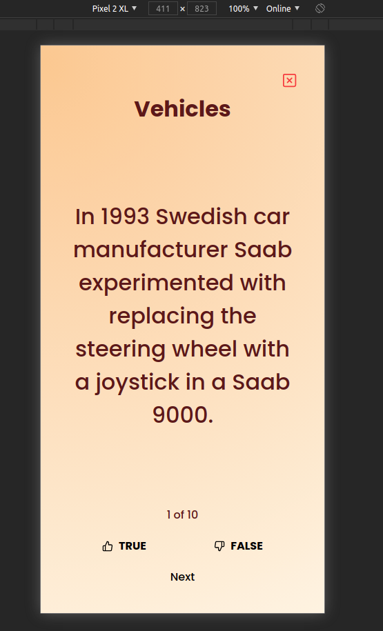

# Requirements

* Node `v12.5.0`

# Instalation

To install and test this project you have to follow this steps:
* Copy project files to a folder
* Install dependencies running
>`npm install`
>
>or
>
>`yarn`

# Usage
This project gives to user a chance to responde 10 random questions.
It basically has 3 pages which control all flow.

### Dashboard
Begin of the quiz. The user press "Begin" button to start.

### Quiz Question
Example of one loaded question.

### Quiz Result
List of rigth answers and list of questions with indicative.

## Optional Commands

This project has tests. So you can run they with command
> `yarn test`
>
> or
>
> `rpm run test`

